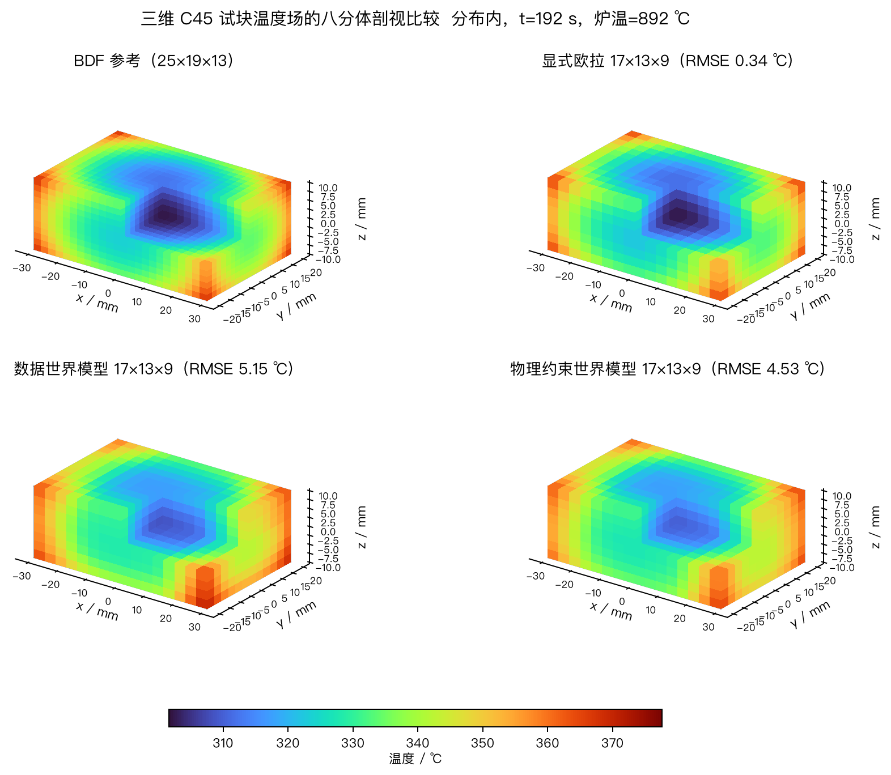

# 金属热处理物理约束世界模型

本仓库保存本科毕业论文《基于物理约束世界模型的金属热处理温度场演化预测与闭环控制研究》的代码、实验配置、结果图、论文源文件和答辩材料。

> [!IMPORTANT]
> **学术诚信声明**
> 本项目公开内容仅供学习、研究复现和方法参考。禁止将论文文字、代码、图表、实验结果或模型输出未经清晰引用直接用于课程作业、学位论文、竞赛或其他成果申报。使用者应遵守所在学校、期刊和会议的学术规范。详见 [`ACADEMIC_USE_NOTICE.md`](ACADEMIC_USE_NOTICE.md)。

研究对象是 C45 钢试块的非稳态传热过程。模型学习带控制输入和工艺参数的温度场状态转移：

\[
\mathbf{T}_{k+1}=F_\theta(\mathbf{T}_k, T_{\infty,k}, \mathbf{p})
\]

网络可递归推演完整温度轨迹，并供状态估计和滚动时域控制调用。训练目标同时包含数据误差和离散热传导残差。动态对流与辐射边界通过有效换热系数 \(H_{\mathrm{eff}}\) 表示，以处理本文瞬时观测模型下的局部不可辨识性。



## 研究内容

- 一维对称平板的有限差分数据生成与物理约束状态转移模型
- 控制轨迹、材料参数和动态边界条件下的样本外泛化
- 基于 \(H_{\mathrm{eff}}\) 的因果边界观测器与噪声压力测试
- EnKF 稀疏测温状态估计与不确定性传播
- 带常值尾部假设的单移动阻塞滚动时域控制
- BDF 交叉求解器数值验证与在线推理计时
- \(17\times13\times9\) 三维温度场世界模型，共 1,989 个状态量

## 主要结果

下表列出论文主张所依赖的代表性结果。完整统计量和适用边界见 `docs/` 与论文正文。

| 研究问题 | 代表性结果 |
| --- | --- |
| 控制轨迹 OOD 的物理一致性 | 物理约束模型的离散残差降低 44.8% |
| 四参数联合 OOD 的尾部风险 | 最大绝对误差由 121.76 °C 降至 61.69 °C |
| 动态边界状态估计 | 引入 \(H_{\mathrm{eff}}\) 后 rollout RMSE 由 \(2.285\pm0.108\) °C 降至 \(1.409\pm0.068\) °C |
| 交叉求解器在线计算 | 相对 BDF 数值推演获得 55.4 倍在线加速 |
| 五传感器稀疏观测 | 未观测节点 RMSE 为 1.073 °C |
| 严格参数 OOD 风险控制 | 配对目标函数平均下降 1.737，bootstrap 95% CI 为 [-3.291, -0.226] |
| 三维 ID 物理一致性 | 隐式能量残差由 4.758 °C 降至 3.259 °C |

三维实验在 ID 能量一致性上给出正向证据。其控制 OOD 精度差异尚未形成统计优势，因此三维部分用于验证方法的空间扩展可行性，不承担超出证据范围的性能主张。

## 目录结构

```text
.
├── defense-slides/          # HTML 答辩演示文稿
├── docs/                    # 实验冻结、复现和专题研究记录
├── outputs/                 # 轻量结果：JSON、CSV 和 PNG
├── paper/                   # 通用 LaTeX 论文源文件
├── paper-csust/             # 长沙理工大学模板版本
├── scripts/                 # 数据生成、训练、评估和绘图入口
├── src/heat_world_model/    # 模型、求解器、估计器和控制器
└── tests/                   # 单元与集成测试
```

## 代码与模型权重

- 源代码仓库：<https://github.com/khakhasshi/heat-treatment-world-model>
- 公开版本标签：`thesis-open-release-v1`
- 模型权重：Hugging Face 发布包包含论文使用的 14 个正式检查点、模型卡和 SHA-256 清单
- 权重清单：[`docs/huggingface-weights-manifest.csv`](docs/huggingface-weights-manifest.csv)

GitHub 仓库用于保存训练、评价、状态估计、控制与绘图代码，同时保存论文源文件和可直接核对的轻量实验结果。模型权重单独发布到 Hugging Face，避免二进制文件进入 Git 历史。两处发布内容使用同一文件清单和哈希值建立对应关系。

## 环境安装

推荐 Python 3.11 至 3.13。项目使用 `uv` 管理环境：

```bash
uv sync --extra dev
uv run --no-sync pytest -q
```

也可以使用现有 Python 环境：

```bash
python -m venv .venv
source .venv/bin/activate
pip install -e '.[dev]'
pytest -q
```

## 实验复现

生成轨迹并训练一维基线模型：

```bash
uv run --no-sync generate-heat-trajectories --trajectories 100 --steps 300
uv run --no-sync compare-heat-world-models \
  --dataset outputs/world_model_dataset.npz \
  --output-dir outputs/world_model_run \
  --epochs 100 --rollout-horizon 5 --physics-weight 0.01
```

运行主要专题实验：

```bash
uv run --no-sync evaluate-parameter-ood
uv run --no-sync evaluate-dynamic-boundary-ood
uv run --no-sync analyze-boundary-observer
uv run --no-sync evaluate-effective-boundary
uv run --no-sync evaluate-cross-solver
uv run --no-sync evaluate-closed-loop-control
uv run --no-sync evaluate-partial-observability
uv run --no-sync evaluate-ood-partial-observability
```

三维模型的数据生成、训练和分析命令见 [`docs/three-dimensional-world-model.md`](docs/three-dimensional-world-model.md)。三维正式配置采用 \(17\times13\times9\) 网格。训练产物默认写入 `outputs/three_dimensional_world_model/`。

不同脚本的详细参数可通过 `--help` 查看。正式结果对应的配置、随机种子和文件哈希记录在 [`docs/experiment-freeze.md`](docs/experiment-freeze.md) 及各专题文档中。

## 编译论文

通用版本：

```bash
make -C paper
```

长沙理工大学模板版本：

```bash
make -C paper-csust thesis
```

编译结果分别写入 `paper/build/main.pdf` 和 `paper-csust/build/thesis.pdf`。学校模板中的学号、班级和指导教师字段仍需在 `paper-csust/baseinfo.tex` 中填写。

## 查看答辩幻灯片

```bash
python3 -m http.server 9187 --directory defense-slides
```

浏览器访问 <http://127.0.0.1:9187/>。演示文稿为原生 HTML，可使用方向键翻页。

## 数据与版本策略

仓库纳入源代码、配置、论文源文件、正式插图，以及便于核对结果的 JSON、CSV 和 PNG。模型权重不进入 Git，由 Hugging Face 单独托管。生成数据集和逐点预测数组通常为 `.npz` 或 `.npy`，可由脚本重建。冻结实验的关键产物以 SHA-256 哈希记录，便于检查论文数字与本地文件是否一致。

数值真值来自有限差分或 BDF 求解器。当前工作不包含真实炉体实验，也不建立相变、组织演化、残余应力和变形模型。论文中的 350 °C、300 s 工况用于方法学基准。

## 许可与引用

源代码按 [MIT License](LICENSE) 开放。公开模型权重采用 CC BY-NC 4.0，仅限非商业使用并要求署名。论文、图表和实验结果的使用还应遵守 [`ACADEMIC_USE_NOTICE.md`](ACADEMIC_USE_NOTICE.md) 中的学术诚信要求。许可证允许合规研究复用，不构成对剽窃、代写或虚假署名的授权。引用信息见 [`CITATION.cff`](CITATION.cff)。

## 作者

江景哲

<contact@jiangjingzhe.com>
